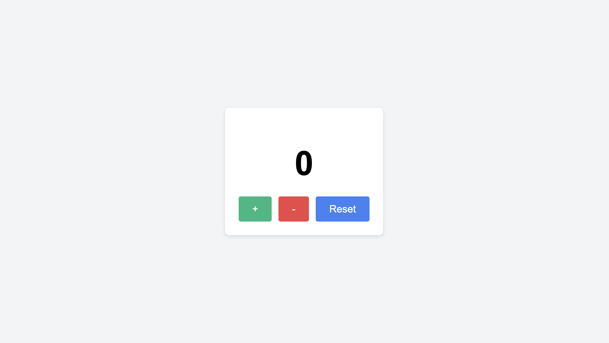
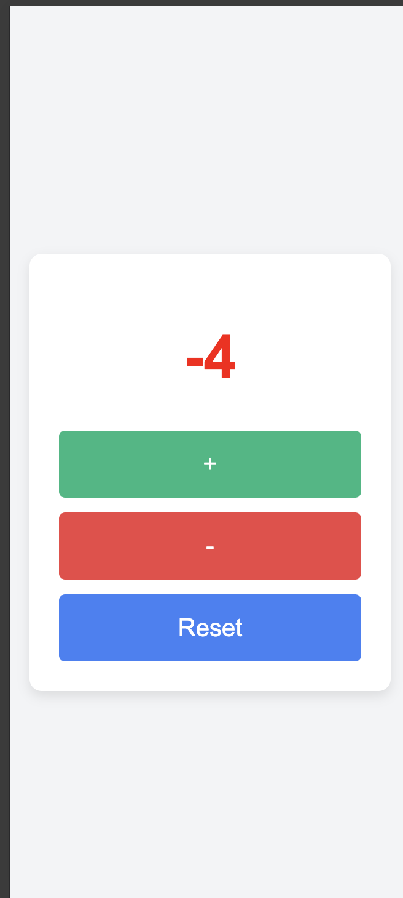

# 🧮 Counter App

A simple, responsive counter application built with **HTML**, **CSS**, and **JavaScript**.

---

## 🚀 Live Demo
[Click here to try it out!](https://lens2199.github.io/counter-app/)

---

## 📸 Screenshots

### 🖥️ Desktop View

### 📱 Mobile View

---

## 🛠️ Features

- ✅ Increase, Decrease, and Reset counter
- ✅ Color change based on counter value:
  - Green = Positive  
  - Red = Negative  
  - Black = Zero
- ✅ Hover animations on buttons
- ✅ Fully responsive layout for mobile devices
- ✅ Built using best practices with Git, GitHub, and Jira (Scrum)

---

## 🧠 What I Learned

- DOM manipulation using JavaScript
- Event handling with `addEventListener`
- CSS Flexbox and Media Queries
- Git workflow with branches and pull requests
- Scrum-style task management with Jira

---

## 📁 Project Structure

counter-app/ ├── index.html ├── style.css ├── script.js └── README.md